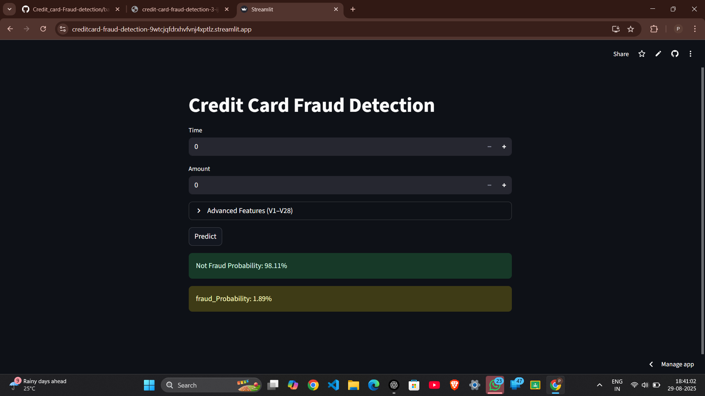
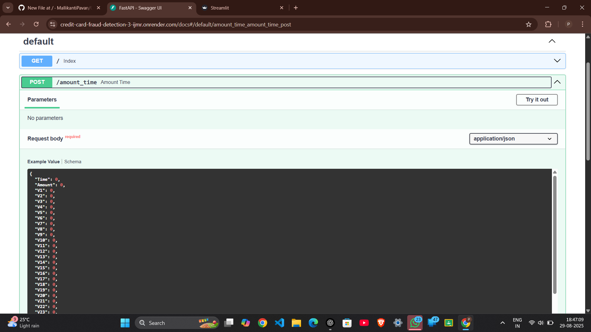

<h1>Credit Card Fraud Detection</h1>

🚀 A machine learning-based web application to detect fraudulent credit card transactions using Logistic Regression.
The dataset used is from the Kaggle Credit Card Fraud Detection dataset
.

<h3>🌐 Live Demo</h3>

FastAPI Backend: https://credit-card-fraud-detection-3-ijmr.onrender.com/

Streamlit Frontend: https://creditcard-fraud-detection-9wtcjqfdrxhvfvnj4xptlz.streamlit.app/

<h3>📸 Screenshots</h3>
<p align="center">
  
  
</p>


<h3>⚙️ Tech Stack</h3>

Machine Learning: Logistic Regression (scikit-learn)

Backend: FastAPI

Frontend: Streamlit

Model Serialization: Pickle

Deployment: Render (FastAPI) & Streamlit Cloud

<h3>📂 Project Structure</h3>
```
Credit_card-Fraud-detection/
│── backend/
│ ├── main.py # FastAPI app
│ ├── train.py # Model training script
│ ├── credit.pkl # Trained ML model
│ ├── scaler_amount.pkl # Amount feature scaler
│ ├── scaler_time.pkl # Time feature scaler
│ ├── requirements.txt # Backend dependencies
│ └── start.sh # Deployment script
│
│── frontend/
│ ├── index.py # Streamlit app
│ └── requirements.txt # Frontend dependencies
│
└── README.md
```

<h3>⚡ How It Works</h3>

User inputs transaction details (time, amount, and features V1–V28).

Data is preprocessed using trained scalers.

Logistic Regression model predicts fraud probability.

Output is displayed in Streamlit frontend and can be queried via FastAPI endpoints.

<h3>🚀 Installation & Setup</h3>

Backend (FastAPI)
cd backend
pip install -r requirements.txt
uvicorn main:app --reload


Access at: http://127.0.0.1:8000/docs

Frontend (Streamlit)
cd frontend
pip install -r requirements.txt
streamlit run index.py


Access at: http://localhost:8501

<h3>📊 Model Details</h3>

Algorithm: Logistic Regression

Evaluation Metric: Accuracy, Precision, Recall, F1-Score

Dataset: Kaggle - Credit Card Fraud Detection

<h3>🤝 Contributing</h3>

Feel free to fork this repo and submit pull requests.
